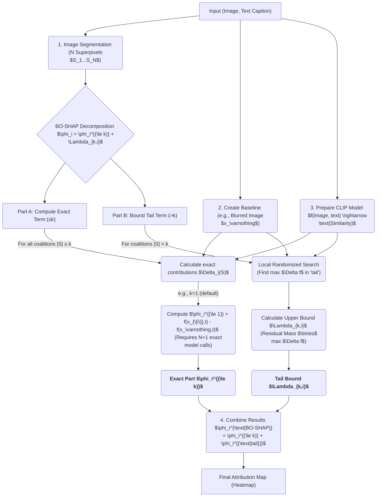

# 👨‍💻 김승겸 | Computer Engineering Student @ Dankook University
> “AI의 설명 가능성과 효율성을 함께 탐구하며, 기술로 문제를 해결하는 개발자를 목표로 합니다.”

## 📫 연락처
📧 **Email:** 32210813@dankook.ac.kr  
📞 **Phone:** 010-4037-2783  
🌐 **GitHub:** [32210813](https://github.com/Rebecca-Dorothy-Willow-Graem)

## 🏅 Highlights
- 🎓 **단국대학교 컴퓨터공학과 (GPA 4.15 / 4.5)**  
- 🧠 **BO-SHAP for CLIP 프로젝트** — XAI + Bayesian Optimization 연구  
- 🏆 **4학기  성적우수**, 학과 수석 및 차석 이력  
- ☁️ **AI × Cloud 자동화 시스템 구축 목표**
  
## 🎓 학력

| 학교 | 전공 | 기간 | 비고 |
|------|------|------|------|
| 가좌고등학교 | - | 2018.03 ~ 2021.01 | 졸업 |
| 단국대학교 | 컴퓨터공학과 | 2021.03 ~ 2027.02 | GPA 4.15 / 4.5 (졸업 예정) |

## 🗓️ 학업 타임라인

| 연도 | 내용 |
|------|------|
| **2021** | 단국대학교 입학 — SW융합코딩, 창의적사고와코딩 수강 |
| **2022~2023** | 군휴학 (2022.03 ~ 2023.09) |
| **2024** | 복학 — 운영체제, 알고리즘, 자료구조, OS/NW 실습 |
| **2025** | SW보안개론, 데이터베이스, XAI 프로젝트 수행 |
| **2026** | 졸업 예정 — 자격증 취득 및 팀 프로젝트 완료 |

## 🏆 성적 우수 내역

| 연도/학기 | 취득학점 | 평균학점 | 비고 |
|------------|-----------|-----------|------|
| 2021 1학기 | 18 | 4.06 | 성적우수 |
| 2024 1학기 | 21 | 4.21 | 성적우수 |
| 2024 2학기 | 23 | 4.17 | 성적우수 (학과 수석) |
| 2025 1학기 | 21 | 4.43 | 성적우수 (학과 차석) |
## 💻 Tech Stack

| 분야 | 기술 | 숙련도 |
|------|------|--------|
| 언어 | ,  | ⭐⭐⭐ ☆ ☆ |
| 프레임워크 |  | ⭐⭐ ☆  ☆ ☆|
| 도구 | ,  | ⭐⭐⭐⭐☆|
| 협업 | ,  | ⭐⭐ ☆ ☆ ☆|

## 🧠 프로젝트 경험

### 🧩 [BO-SHAP for CLIP: Efficient Image–Text Explanation](https://github.com/Rebecca-Dorothy-Willow-Graem/clip-xai-bo-shap)
> *Efficient SHAP-based Explainable AI method for CLIP model*

#### 📌 개요
- **참여 프로그램:** 단국대 학부생 논문 지원 사업  
- **주제:** CLIP 이미지–텍스트 매칭 모델에 대한 효율적 SHAP 구현  
- **핵심 목표:** 기존 SHAP의 계산 복잡도를 줄이면서 동일한 설명 품질 유지

#### ⚙️ 기술적 구성
- **모델:** `openai/clip-vit-base-patch32` (HuggingFace Transformers)  
- **데이터셋:** Flickr8k (image–caption pairs)  
- **핵심 모듈:**
  - `bo-shap.py` : grid superpixels 기반 BO-SHAP: ≤k 정확 계산 + tail 상계(BO-like 탐색)  
  - `bo_shap_clip_partition_tree.py` : SHAP partition-tree superpixels로 동일 알고리즘 적용  
  - `compare_shap_vs_bo.py` : 원본 SHAP vs BO-SHAP 품질 비교(Deletion/Insertion 곡선, Spearman, L1, Coverage) & 오버레이 저장
  - `bo_shap_budget_sweep.py` : 예산 스윕(k, trials)으로 목표 품질에 도달하는 최소 호출 수/시간 탐색
  - `time_compare_shap_vs_bo.py` : 런타임/모델 호출 수 간단 비교(≤k exact만)
  - `clip_shap_faithful.py` : CLIP+SHAP 기본 설명 시각화
  - `collect_results.py` : 여러 실험 결과 집계(CSV)

#### 📊 성능 비교

| 방법 | 시간(초) | 모델 호출 수 | Deletion AUC |
|------|-----------|--------------|---------------|
| Standard SHAP | 40–55s | ~800 | 0.20 |
| **BO-SHAP (제안)** | **2–4s (+tail ≤45s)** | ~80–1100 | **0.20 (동일)** |

#### 🚀 성과
- **연산 속도 10~20× 가속, 설명 품질(Deletion/Insertion) 동등 수준 유지**
- **정확 ≤k Shapley + tail 상계(BO-like 탐색)로 모델 호출 수/시간 절감**
- **공통 슈퍼픽셀(Partition-tree)로 공정 비교 및 커버리지(상계 내 오차) 체크 지원**

## 🌍 대외 활동

- **개혁신당 단국대학교 캠퍼스 지부장** — 교내 지부원 의겸 수렴 및 전달
- **경기·인천 캠퍼스 지부장 대표** — 지부 간 협력, 조정 및 리더십 활동  
- **미래희망위원회 운영위원** — 지부 조직 관리, 중앙 협의회 활동

## 🎯 학습 목표

- **자격증 취득**
  - 📘 정보처리기사  
  - 📊 빅데이터 분석기사  

- **팀 프로젝트 수행**
  - 🧠 *AI 기반 클라우드 인프라 관측·장애 자동복구 시스템*  
  - 🔧 목표: AWS, Terraform, Kubernetes 등 연동 숙달
 

## 🌱 성장 과정
BO-SHAP 프로젝트를 통해 **AI의 ‘설명가능성(Explainability)’**이  
모델 신뢰도 향상에 얼마나 중요한지 깨달았습니다.  

이후 딥러닝 모델의 해석력과 효율성을 함께 개선하는 연구에 흥미를 가지게 되었고,  
현재는 **AI × 클라우드 자동화** 분야로 확장하여  
시스템적 사고를 갖춘 개발자로 성장하고자 합니다. 

